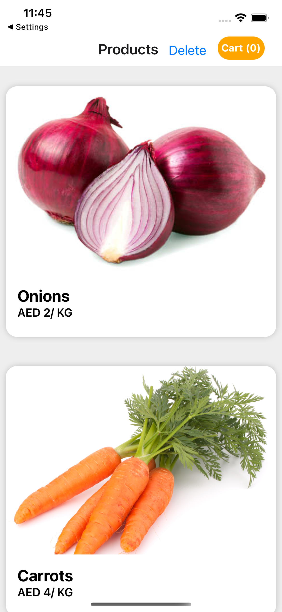
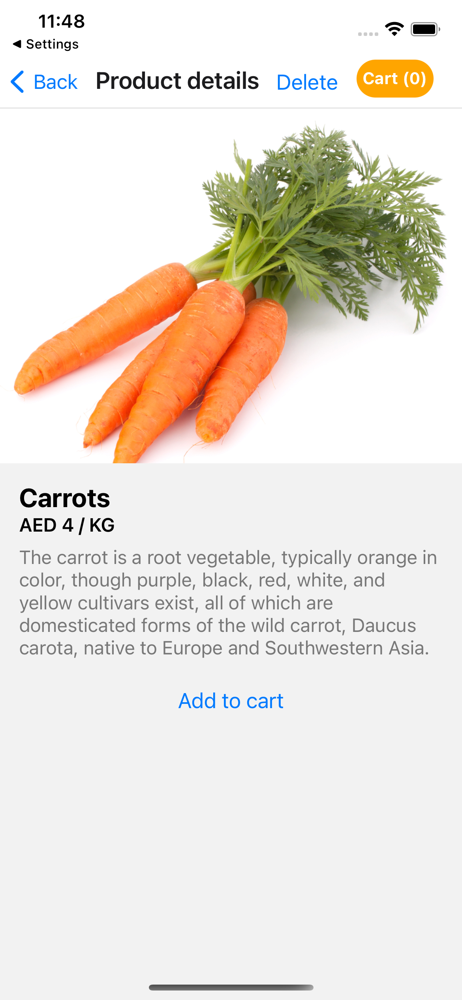
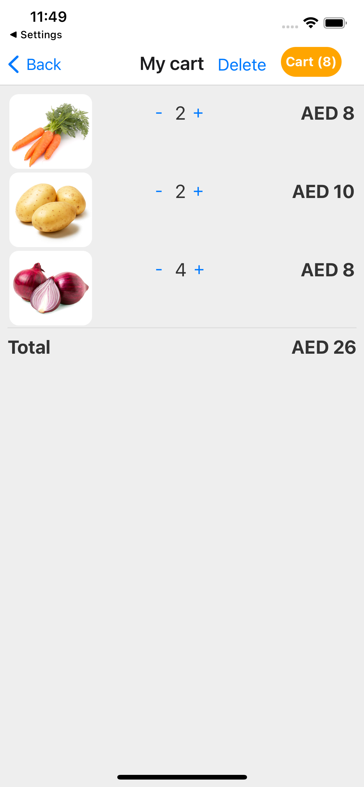

# react-native-ecommerce
A minimal React Native Shopping Cart app template.

This project provides a minimal starter project structure for your next awesome react-native shopping cart app. 

- Screens: products list, details, and shopping cart summary.
- Simple state management with React Context API.
- Easy to extend with additional features.
- A mock API service for product data.
- Built with [Expo](https://expo.dev).

## Sample Screens

### Products List

### Product Details

### Shopping Cart Summary

# Installation

Installation for dependencies using 
yarn

then after that run the application  
yart start  OR  expo start

